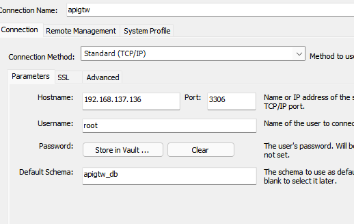
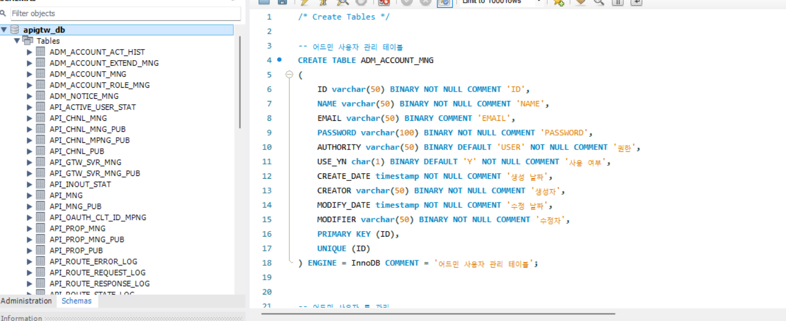
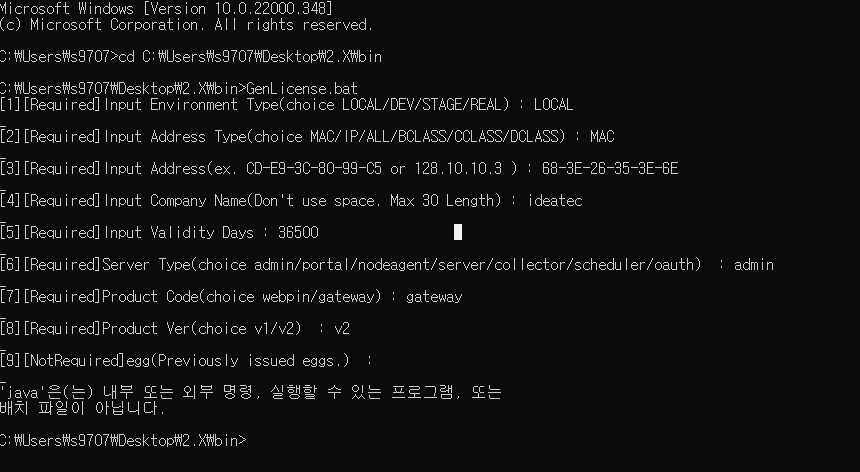
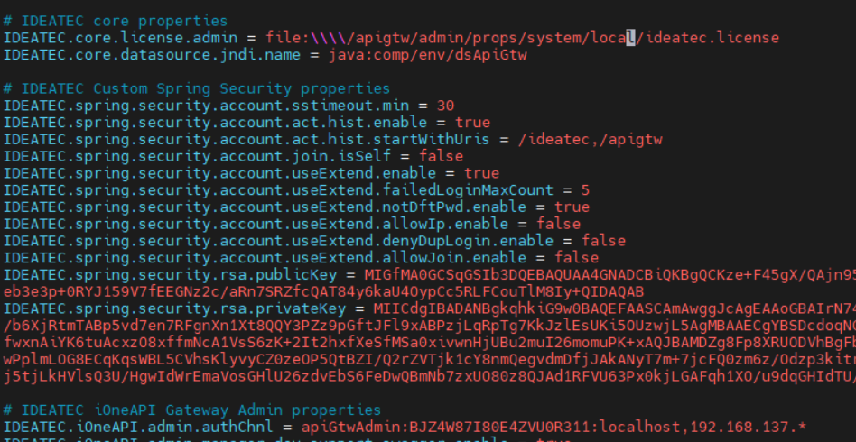
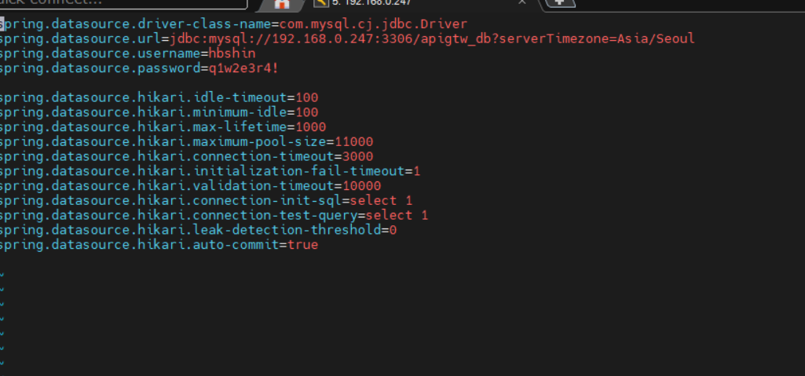
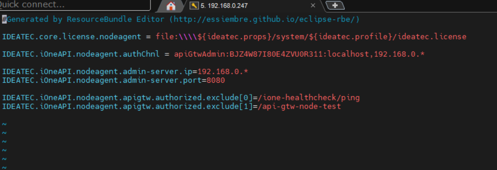
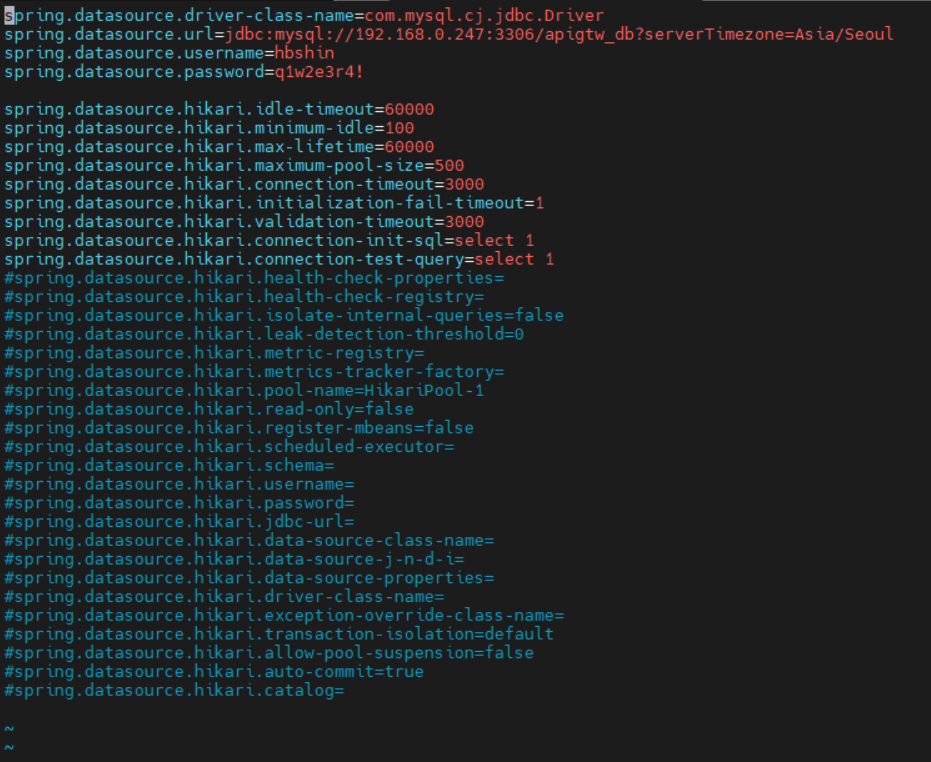
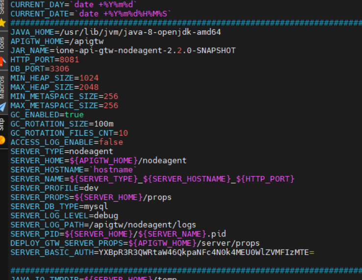
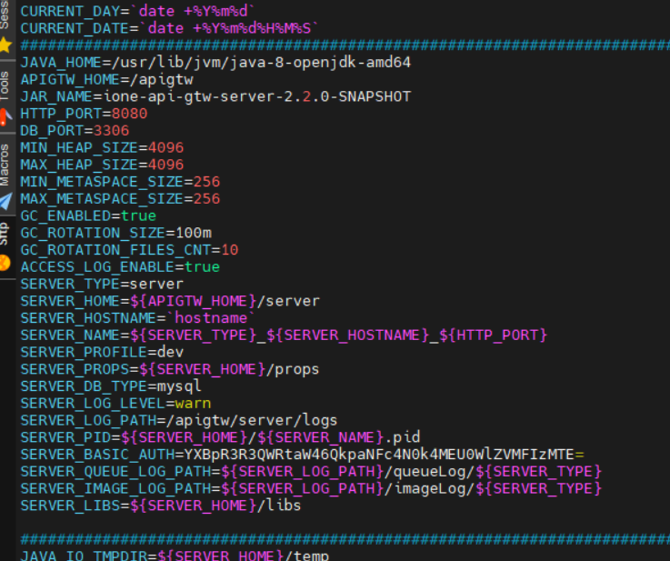

## apigtw-containerization (~ing)
<br>

## mysql 

```
version: "3"
services:
  db:
    image: mysql:8.0
    restart: always
    command: --lower_case_table_names=1
    container_name: apigtwdb
    ports:
      - "3306:3306"
    environment:
      - MYSQL_ROOT_PASSWORD=qwer1234
      - TZ=Asia/Seoul
    command:
      - --character-set-server=utf8mb4
      - --collation-server=utf8mb4_unicode_ci
    volumes:
      - /root/data/apigtw\mysql:/var/lib/mysql
```
```
- # docker-compose.yml 파일을 docker-compose up 명령어로 실행하여,
apigtw용 mysql을 생성합니다. 
```



```
- 위에서 생성한 mysql을 기반으로 mysqlcontainer가 있는 서버IP를 통해
mysql workbench에서 DB연결하고 Hostname에 서버IP와 port입력하여 연동
```


```
- apigtw db table 제작
```

## apigtw - admin

```
FROM ubuntu:20.04

RUN apt-get update
RUN apt-get install -y openjdk-8-jdk

RUN mkdir -p /apigtw

ADD admin.tar /apigtw

COPY ./setenv.sh /apigtw/admin/bin/
COPY ./context.xml /apigtw/admin/conf/
COPY ./ione-api-gtw-admin-2.2.0-SNAPSHOT.war /apigtw/admin/deploy/
COPY ./ideatec.license /apigtw/admin/props/system/dev/
COPY ./ideatec.properties /apigtw/admin/props/system/dev/


EXPOSE 8080 8443
```
```
- docker image build를 위해 dockerfile을 작성하고 명령어를
통해 image build
- # docker build -t 이미지명 . 
- 다음은 container를 명령어를 통해 실행시킵니다.
- # docker run -dit --name 컨테이너명 -p 입력포트:호출포트 이미지명 bash
```


```
- 실행 후 # docker ps -a 명령어를 통해 위와 같이 실행중인 
container 리스트 조회가 가능합니다.
```
```
- container를 실행했다면 다음 명령어를 통해 container로 접속
- # docker exec -it 컨테이너명 bash 
- 접속 후에 apigtw 설정작업을 합니다.
```


```
- 먼저 apigtw/admin/conf/context.xml 파일을 열어서 
위에서 연결했던 DB정보에 맞게 URL , username , password 수정
```


```
- /apigtw/admin/bin/setenv.sh 파일을 열어서 아래 목록들 수정
- JAVA_HOME : 나의 서버 자바 경로 입력 (jdk-1.8)
- APIGTW_HOME : 내 서버 기준에 맞춰서 수정
- WAR_NAME : 위에 입력되어 있는 이름과 맞춘다.
- SERVER_PROFILE : license 생성시 Environment Type과 맞춰서 입력
- SERVER_LOG_PATH : log가 생성될 경로에 맞게 수정
```


```
- license 설정을 위해서 apigtw/admin/props/system/으로 이동
- 자신이 설정한 EnvironmentType에 맞게 디렉토리명을 변경(거의 DEV통일)
```


```
- license 생성과정입니다.
- 설치파일 bin 파일경로를 cmd를 통해 접속합니다.
- GenLicense.bat 파일을 통해 실행
- 사진과 비슷하게 목록중 선택해서 라이센스 발급받기
- 발급 받으면 라이센스 키를 
/apigtw/admin/props/system/local/ideatec.license파일에 입력
```



```
- 같은경로에서 ideatec.properties 파일에 들어와서
- license.admin 파일경로 맞춰서 수정
- 아래 admin.authchnl에 마지막 IP 주소를
나의 ip 주소를 읽을수 있도록 맞게 설정하고 서버 재기동
```

## apigtw - collector 
<br>

```

FROM ubuntu:20.04

RUN apt-get update
RUN apt-get install -y openjdk-8-jdk

RUN mkdir -p /apigtw

ADD collector.tar /apigtw

COPY ./setenv.sh /apigtw/collector/bin/
COPY ./ione-api-gtw-collector-2.2.0-SNAPSHOT.jar /apigtw/collector/deploy/
COPY ./ideatec.license /apigtw/collector/props/system/dev/
COPY ./ideatec.properties /apigtw/collector/props/system/dev/
COPY ./collector-spring.properties /apigtw/collector/props/system/dev/

EXPOSE 58080

```
```
- collector 관련 위 Dockerfile 작성 후 마찬가지로 명령어를 통해 
image build 후 container 올리고 접속
- admin과 같이 서버 올라가면 명령어로 접속 후 파일 수정
```


```
- /apigtw/collector/bin/setenv.sh 파일을 열어서 아래 목록들 수정
- JAVA_HOME : 나의 서버 자바 경로 입력 (jdk-1.8)
- APIGTW_HOME : 내 서버 기준에 맞춰서 수정
- WAR_NAME : 위에 입력되어 있는 이름과 맞춘다.
- SERVER_PROFILE : license 생성시 Environment Type과 맞춰서 입력
- SERVER_LOG_PATH : log가 생성될 경로에 맞게 수정
```


```
- properties 파일에서 ip 맞는지 확인
```



```
- collector-spring.properties 파일에서 url,username,password 수정
```

## apigtw - nodeagent

```
FROM ubuntu:20.04

RUN apt-get update
RUN apt-get install -y openjdk-8-jdk

RUN mkdir -p /apigtw

ADD nodeagent.tar /apigtw

COPY ./setenv.sh /apigtw/nodeagent/bin/
COPY ./ione-api-gtw-nodeagent-2.2.0-SNAPSHOT.jar /apigtw/nodeagent/deploy/
COPY ./ideatec.license /apigtw/nodeagent/props/system/dev/
COPY ./ideatec.properties /apigtw/nodeagent/props/system/dev/
COPY ./nodeagent-spring.properties /apigtw/nodeagent/props/system/dev/

EXPOSE 8081

```
```
- nodeagent 관련 Dockerfile 작성 후 마찬가지로 명령어를 통해 
image build 후 container 올리고 접속
```


```
- properties 파일에서 authChnl 마지막 IP주소 확인
```



```
- nodeagent-spring.properties 파일에서 url,username,password 수정
```



```
- /apigtw/nodeagent/bin/setenv.sh 파일을 열어서 아래 목록들 수정
- JAVA_HOME : 나의 서버 자바 경로 입력 (jdk-1.8)
- APIGTW_HOME : 내 서버 기준에 맞춰서 수정
- WAR_NAME : 위에 입력되어 있는 이름과 맞춘다.
- SERVER_PROFILE : license 생성시 Environment Type과 맞춰서 입력
- SERVER_LOG_PATH : log가 생성될 경로에 맞게 수정
```

## apigtw - server

```
FROM ubuntu:20.04

RUN apt-get update
RUN apt-get install -y openjdk-8-jdk

RUN mkdir -p /apigtw

ADD server.tar /apigtw

COPY ./setenv.sh /apigtw/server/bin/
COPY ./ione-api-gtw-server-2.2.0-SNAPSHOT.jar /apigtw/server/deploy/
COPY ./ideatec.license /apigtw/server/props/system/dev/
COPY ./ideatec.properties /apigtw/server/props/system/dev/

EXPOSE 8080

```

```
- server 관련 Dockerfile 작성 후 마찬가지로 명령어를 통해 
image build후 container 올리고 접속
```


```
- properties 파일에서 ip 확인
```



```
- - /apigtw/server/bin/setenv.sh 파일을 열어서 아래 목록들 수정
- JAVA_HOME : 나의 서버 자바 경로 입력 (jdk-1.8)
- APIGTW_HOME : 내 서버 기준에 맞춰서 수정
- WAR_NAME : 위에 입력되어 있는 이름과 맞춘다.
- SERVER_PROFILE : license 생성시 Environment Type과 맞춰서 입력
- SERVER_LOG_PATH : log가 생성될 경로에 맞게 수정


- admin , collector , nodeagent , server 모두 재기동 후 
http:// 서버 IP : admin 포트번호를 통해 접속 후 확인.
```

