## kubernetes
<br>

```
- kubernetes란?
쿠버네티스(Kubernetes, 쿠베르네테스, "K8s")는 
컨테이너화된 애플리케이션의 자동 디플로이, 스케일링 등을 
제공하는 관리시스템으로, 오픈 소스 기반이다. 
원래 구글에 의해 설계되었고 현재 리눅스 재단에 의해 관리되고 있습니다.

- container orchestration
복잡한 컨테니어 환경을 효과적으로 관리하기 위한 도구 
```

## pod


```
- 각 pod 마다 고유 ip 를 부여받습니다.
- pod 하나에 보통 하나의 컨테이너가 존재하지만, 여러개도 존재가 가능합니다.
- port를 localhost로 공유도 가능합니다.
```

## 동작방식


```
- container를 빌드하여 docker hub에 push해놓고 kubernetes에서 
CLI(명령어)방식 또는 yaml 파일을 통해  master node(control-plan)에 
요청하면 API server가 요청을 받습니다.
api는 요청에 따라 여러대의 노드에서 적합한 노드를 찾기 위해 
scheduler에 요청합니다. 그럼 scheduler가 현재 노드의 상태를 보고 
적합한 노드를 찾아 응답을 합니다. 그럼 api는 scheduler에 요청에 
따라 적합한 노드에 kubelet에게 요청을 받아 도커명령어로 변환해서 
도커데몬에게 container를 실행요청을 하고 도커 데몬이 허브에서 
요청과 맞는 컨테이너를 찾아 실행하고 그 실행을 pod라는 단위로 관리합니다.
```


```
- 사용자가 호출하면 API가 요청을 제일 먼저 받고 
api는 etcd 저장소에 데이터를 요청합니다.
etcd(node에 상태정보,컨테이너 동작상태) 가 정보를 갖고 있을 수 있는 이유는 
node에는 kubelet이라는 컴포넌트가 있는데 kubelet 실행하면서 
cadvisor라는 컨테이너 모니터링 툴이 포함되어 있어서 
cadvisor가 컨테이너의 상태 및 정보수집을 통해 etcd에 전달해서 etcd가 저장합니다. 
다시 그럼 api가 etcd에서 문법체크를 하고 정보를 확인해서 
schduler에게 서버1개를 실행하기 위해 적합한 노드를 찾아달라고 요청하고 
schduler는 적합한 노드를 선택해서 api에게 다시 요청을 돌려주고 
api가 node kubelet에 서버 실행요청을하고 kubelet 은 도커명령어로 변환해서 
도커에게 서버 실행요청을 하면 최종적으로 도커가 도커 허브에서 
적합한 서버 버전점검후 받아와서 동작을 시켜줍니다.
```

## namespace 

```
- kubernetes object에는 pod이외에 
label, deployment,statefulset, secret 등 
다양한 리소스 존재하기 때문에 이를 쉽게 관리하기 위해 
존재하는 것이 namespace 입니다.
- namespace란 , 쿠버네티스 클러스터(여러 대의 컴퓨터들이 연결되어 
하나의 시스템처럼 동작하는 컴퓨터들의 집합을 말한다) 
내의 논리적인 분리 단위, 즉 물리적인 클러스터는 1개지만
논리적으로는 여러개를 사용하는것.
```
```
CLI
$ kubectl create namespace blue
$ kubectl get namespaces

yaml - 데이터 직렬화 양식 / 기본 문법
$ kubectl create namespace green --dry-run=client -o yaml > green-ns.yaml 
$ vim green-ns.yaml
$ kubectl create -f green-ns.yaml

namespace 관리
$ kubectl get namespace
$ kubectl delete namespace
```

## API version 종류

```
- Deployment
- pod
- ReplicaSet
- ReplicationController
- Service
- PresistentVolume
```

## pod create

```
- CLI : kubectl run 서버명 --image=nginx
- yaml : 아래사진 참조
```


```
- pod 실행 : kubectl create -f yaml(name)
- 동작중인 pod 확인 command
	- kubectl get pods
	- kubectl get pods -o wide
	- kubectl get pods -o yaml
    - kubectl get pods -o json
```

## multi-container pod create


```
- container 2개 실행
- kubectl create -f yaml명
- kubectl exec multipod -it -c 접속할 컨테이너명 --/bin/bash
- curl http://localhost:80
```

## pod 동작 flow 

```
- pending : 노드가 선택되는 과정
- running : 배치받고 실행되는 상태
- Succeeded Failed : 실패
```
```
<livenessProbe-self-healing pod : 컨테이너 진단>
kubernetes 3가지 검진방식 지원 

	- httpGet probe : 지정한 IP주소, port, path에 HTTP GET 요청을 보내, 해당 컨테이터가 
	응답하는지를 확인한다. 반환코드가 200이 아닌 값이 나오면 오류, 컨테이너 재시작
	ex : livenessProbe:
		httpGet:
		 path: /
		 port: 80
		
	- tcpSoket probe : 지정된 포트에 TCP연결을 시도. 연결되지 않으면 컨테이너를 다시 시작
	(ssh데몬을 서비스해주는 컨테이너)
	ex : livenessProbe:
		tcpSoket:
		    port: 22
		
	- exec probe : exec 명령을 전달하고 명령의 종료코드가 0이 아니면 컨테이너를 다시 시작
	(특정 컨테이너가 pod기반으로 서비스하는데 백앤드 db에서 특정 데이터를 가져와서 서비스)
	ex : livenessProbe:
		exec:
		 command:
		 -  ls
		 - /data/file
```	

## init container

```
- 컨테이너 관련 정보를 db 에서 가져오는 컨테이너

apiVersion: v1
kind: Pod
metadata:
  name: myapp-pod
  labels:
    app: myapp
spec:
  containers:
  - name: myapp-container
    image: busybox:1.28
    command: ['sh', '-c', 'echo The app is running! && sleep 3600']
  initContainers:
  - name: init-myservice
    image: busybox:1.28
    command: ['sh', '-c', "until nslookup myservice.
    $(cat /var/run/secrets/kubernetes.io/serviceaccount/namespace)
    .svc.cluster.local; do echo waiting for myservice; sleep 2; done"]
  - name: init-mydb
    image: busybox:1.28
    command: ['sh', '-c', "until nslookup mydb.
    $(cat /var/run/secrets/kubernetes.io/serviceaccount/namespace).
    svc.cluster.local; do echo waiting for mydb; sleep 2; done"]

- busybox라는 매인 app이 실행되면서 main container 1개와 2개의 
초기화 컨테이너를 실행 command 에서 until ( false) myservice / my db 
동작중이지 않으면 쉘스크립트 반복하고 실행되면 종료

<init container활용>
- initcontainer 다 묶고 있는 pod에서는 init container가 
성공해야 main container를 구동시킨다.
```

## infra container

```
- pod 생성시 pause container가 같이 생성되고 같이 삭제된다.
- pod 에 대한 ip나 host name 등 관리하고 생성하는게 pause container
즉 일반적인 pod 1개 생성시 자동으로 pause container도 실행되며
생성한 pod를 삭제시 pause container도 자동 삭제된다.

- static pod - kubelet 데몬에 의해 실행되는것
- api 에게 요청을 보내지 않고 node 에는 kubelet이라는 데몬이 존재
ex) nginx 하나를 실행하고 싶으면 kubelet 관리하는 pod dir /yaml 파일
저장 시 자동 실행 / yaml 파일을 지우면 삭제
- /etc/kubernetes/manifests/ 디렉토리에 k8s yaml 파일을 저장 시 적용
- static pod 디렉토리 구성 : # vi /var/lib/kubelet/conmfig.yaml
```

## resource request

```
- 파드를 실행하기 위한 최소 리소스 양을 요청하면서 사용해야 합니다.
- 이유는 첫번째 노드에서 사용량을 다 써버리면 상대적으로 다른 pod가
용량 부족으로 동작할 수 없기 때문입니다.
```
## resource limits

```
- 파드가 사용할 수 있는 최대 리소스 양을 제한해서 다른 node가
동작할 수 있게 조정하는 역할
```
## pod 환경변수

```
1. sidecar - pod안에 container 2개 , 1개는 webserver container는 
로그를 만들고 1개는 분석 및 작업한다. 
즉 로그를 만들어줘야지만 실행할 수 있는 형태의 pod
	
2. adapter - webserver container에 외부에 있는 시스템상태에 대한 
모니터정보가 들어있는 공간에 있는 정보를 어뎁터가 받아와서 
webserver에 전달해주면 고객 , 관리자의 전달해줌
	
3. ambassador - webserver에 고객들이 접속하면 데이터들이 
만들어지는데 필요하다면 분산시켜서 보내줄수있는 컨테이너
```
### controller

- 특정 application 을 운영해주는 pod를 몇개를 운영해줄 것인지를 
결정하고 운영 및 보장하는것

## Replication controller

- 요구하는 pod 의 개수를 보장 / 파드 집합의 실행을 항상 안정적으로 유지

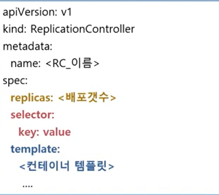

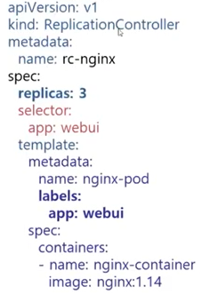


```
- 기본구성 : selector / replicas / template 
- controller : selector를 보고 개수만큼 보장하려고 하고 부족하면 template를 통해 생성
- pod template 은 반드시 selector에 있는 key ,value를 label로 포함하고 있어야한다.
```

## ReplicaSet

```
- replicationController와 성격은 비슷
- 다른점은 풍부한 selector를 지원
	
ex) selector
	matchLabels:
	matchExpressions
		
- matchLabels : key value 사용 replication과 동일
- matchExpressions :  수식 사용가능 
ex) {key: tier, operator: in, values: [cache]}
 {key: environment, operator: Notln, values: [dev]
```
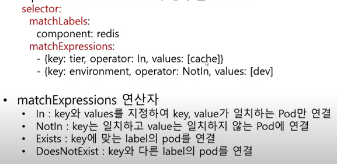

## ReplicationController / ReplicaSet 차이점

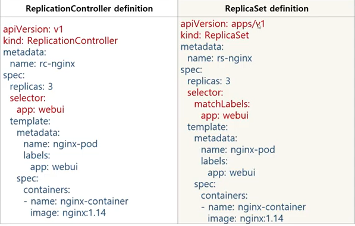

```
- version 에서 apps 가 추가로 입력
- kind
- selector : matchLabels 추가
```

## Deployment

```
- replicaSet 을 컨트롤해서 pod 수를 조절
- Rolling Update / Rolling Back
- ex) 고객에게 버전업데이트 등을 서비스 중단없이 시행
```

## ReplicaSet / Deployment 차이점

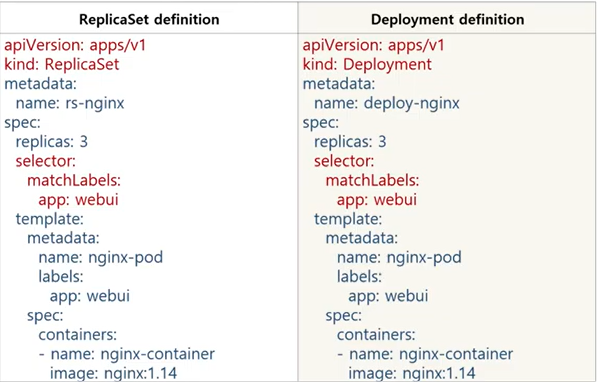

```
- 큰 차이점없이 비슷하게 사용가능
- 즉 부모관계 느낌으로 deploy가 replicaSet을 관리하고 replicaSet이
pod를 관리하므로 replicaSet이 지워지면 deploy가 다시 생성하고
pod가 지워지면 replicaSet이 개수 보장을 해야 하기 때문에 다시
pod를 생성하고 둘다 지워져도 deploy가 다시 생성합니다.
```
## deployment Rolling update command

```
- kubectl set image deployment <deploy_name> <container_name>=<new_version_image>
```
## deployment RollBack command

```
- kubectl rollout history deployment <deploy_name>
- kubectl rollout undo deploy <deploy_name>
```

## deployment Rolling update / rolling back

```
- kubectl 생성 커맨드에서 create 와 aplly 2가지 접근방식이 존재

- 필수관리 : kubectl create :
명령적 관리 - 접근 방식에서는 생성 및 교체 또는 삭제하려는 kubernetes API를 알려줌.

- 선언적 관리 : kubectl apply : 
선언적 관리 - 접근 방식의 일부로 , 라이브 개체 (예 : scale) 에 적용했을 수 있는
변경 사항이 개체에 대한 다른 변경 사항이 있더라도 "유지 관리" 된다.

- 즉, 리소스가 있는 경우 kubectl create는 오류 발생 
/ kubectl apply 는 발생하지 않는다.
```

## DaemonSet + RollingUpdate 

```
- 전체 노드에서 pod가 한 개씩 실행되도록 보장
- 로그 수입기, 모니터링 에이전트와 같은 프로그램 실행 시 적용
```

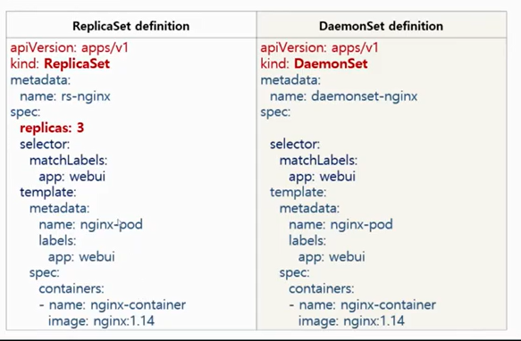

```
- DaemonSet은 node당 pod 가 필수적으로 1개씩 보장되기 때문에 
ReplicaSet처럼 replicas를 설정 할 필요가 없다.
만약 node가 2개에서 3개로 추가된다고해도 daemonSet이 자동으로 pod를 추가해준다.
```

## statefulset

```
- pod의 상태를 유지해주는 컨트롤러
    - pod 이름
    - pod의 볼륨(스토리지)
    - daemonset처럼 node당 1개를 보장하지는 않는다.
```

## replicaSet 과 statefulSet 차이점

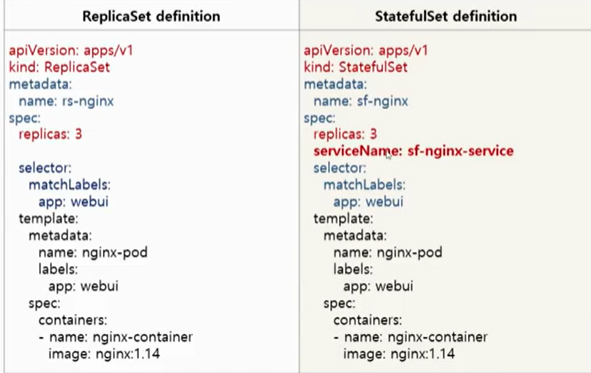

- service name이 추가되는 점.

## JOB 

```
- kubernetes는 pod를 running 중인 상태로 유지
- batch 처리하는 pod 는 작업이 완료되면 종료됨.
- batch 처리에 적합한 컨트롤러로 pod의 성공적인 완료를 보장
- 비정상 종료 시 다시 실행
- 정상 종료 시 완료
```
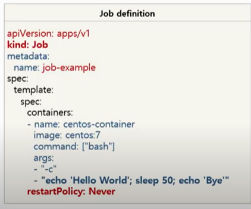

```
- job controller는 restart 정책이 절대적으로 보장됨.
- 즉, 비정상 종료가 확인될 경우 자동으로 재기동시켜주는 controller
```

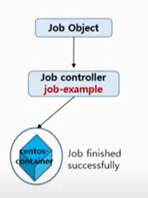

```
- 위 그림처럼 작업이 정상적으로 완료되면 끝, 하지만 만약 작업이 정상적으로 완료되지
못한다면 jobcontroller는 다시 작업을 시작합니다.
```

### example

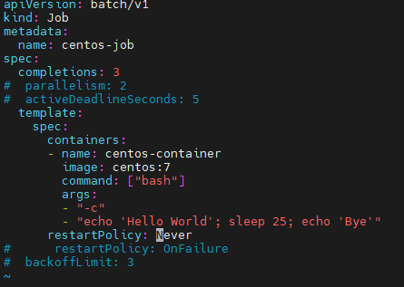

```
- controller centos에 sleep 25초 동작되도록 하며, 3번 실행(completions)을 명령

# kubectl create -f job-exam.yaml
# kubectl get job,pods
# kubectl delete job.apps centos-job
```

## CronJob

```
- 사용자가 원하는 시간에 JOB 실행 예약지원
- job 컨트롤러로 실행할 Application pod 를 주기적으로 반복실행
- Linux 의 cronjob의 스케줄링 기능을 job Controller에 추가한 API

<Cronjob Schedule>
- Minutes (from 0 to 59)
- Hours (from 0 to 23)
- Day of the month (from 1 to 31)
- Month (from 1 to 12)
- Day of the week (from 0 to 6)
```

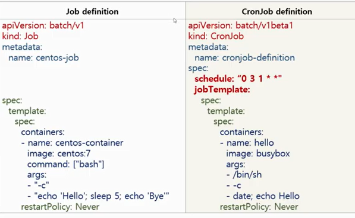

```
- job 과 cronjob의 차이점은 schedule와 job Template가 추가로 적용되는점
```
### example 

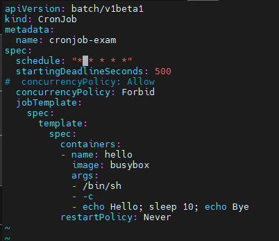

```
- spec : schedule : " * * * * " = 아래의 jobTemplate을 1분마다 한번씩 실행
- startingDeadlineSeconds : 500 =  해당작업을 500초안에 실행시키지 못하면 취소 
concurrencyPolicy : Forbid = 앞서 먼저 실행된 작업이 있으면 그 작업이 
완료되기전까지 재 실행 하지 않는다는 명령

command
# kubectl create -f cronjob-exam.yaml
# kubectl get cronjob
# kubectl get pods
# kubectl delete cronjob cronjob-exam
```


