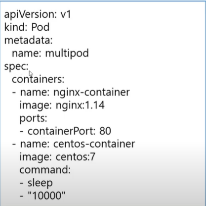

## kubernetes
<br>

```
- kubernetes란?
쿠버네티스(Kubernetes, 쿠베르네테스, "K8s")는 
컨테이너화된 애플리케이션의 자동 디플로이, 스케일링 등을 
제공하는 관리시스템으로, 오픈 소스 기반이다. 
원래 구글에 의해 설계되었고 현재 리눅스 재단에 의해 관리되고 있습니다.

- container orchestration
복잡한 컨테니어 환경을 효과적으로 관리하기 위한 도구 
```

## pod


```
- 각 pod 마다 고유 ip 를 부여받습니다.
- pod 하나에 보통 하나의 컨테이너가 존재하지만, 여러개도 존재가 가능합니다.
- port를 localhost로 공유도 가능합니다.
```

## 동작방식


```
- container를 빌드하여 docker hub에 push해놓고 kubernetes에서 
CLI(명령어)방식 또는 yaml 파일을 통해  master node(control-plan)에 
요청하면 API server가 요청을 받습니다.
api는 요청에 따라 여러대의 노드에서 적합한 노드를 찾기 위해 
scheduler에 요청합니다. 그럼 scheduler가 현재 노드의 상태를 보고 
적합한 노드를 찾아 응답을 합니다. 그럼 api는 scheduler에 요청에 
따라 적합한 노드에 kubelet에게 요청을 받아 도커명령어로 변환해서 
도커데몬에게 container를 실행요청을 하고 도커 데몬이 허브에서 
요청과 맞는 컨테이너를 찾아 실행하고 그 실행을 pod라는 단위로 관리합니다.
```


```
- 사용자가 호출하면 API가 요청을 제일 먼저 받고 
api는 etcd 저장소에 데이터를 요청합니다.
etcd(node에 상태정보,컨테이너 동작상태) 가 정보를 갖고 있을 수 있는 이유는 
node에는 kubelet이라는 컴포넌트가 있는데 kubelet 실행하면서 
cadvisor라는 컨테이너 모니터링 툴이 포함되어 있어서 
cadvisor가 컨테이너의 상태 및 정보수집을 통해 etcd에 전달해서 etcd가 저장합니다. 
다시 그럼 api가 etcd에서 문법체크를 하고 정보를 확인해서 
schduler에게 서버1개를 실행하기 위해 적합한 노드를 찾아달라고 요청하고 
schduler는 적합한 노드를 선택해서 api에게 다시 요청을 돌려주고 
api가 node kubelet에 서버 실행요청을하고 kubelet 은 도커명령어로 변환해서 
도커에게 서버 실행요청을 하면 최종적으로 도커가 도커 허브에서 
적합한 서버 버전점검후 받아와서 동작을 시켜줍니다.
```

## namespace 

```
- kubernetes object에는 pod이외에 
label, deployment,statefulset, secret 등 
다양한 리소스 존재하기 때문에 이를 쉽게 관리하기 위해 
존재하는 것이 namespace 입니다.
- namespace란 , 쿠버네티스 클러스터(여러 대의 컴퓨터들이 연결되어 
하나의 시스템처럼 동작하는 컴퓨터들의 집합을 말한다) 
내의 논리적인 분리 단위, 즉 물리적인 클러스터는 1개지만
논리적으로는 여러개를 사용하는것.
```
```
CLI
$ kubectl create namespace blue
$ kubectl get namespaces

yaml - 데이터 직렬화 양식 / 기본 문법
$ kubectl create namespace green --dry-run=client -o yaml > green-ns.yaml 
$ vim green-ns.yaml
$ kubectl create -f green-ns.yaml

namespace 관리
$ kubectl get namespace
$ kubectl delete namespace
```

## API version 종류

```
- Deployment
- pod
- ReplicaSet
- ReplicationController
- Service
- PresistentVolume
```

## pod create

```
- CLI : kubectl run 서버명 --image=nginx
- yaml : 아래사진 참조
```


```
- pod 실행 : kubectl create -f yaml(name)
- 동작중인 pod 확인 command
	- kubectl get pods
	- kubectl get pods -o wide
	- kubectl get pods -o yaml
    - kubectl get pods -o json
```

## multi-container pod create



```
	- container 2개 실행
	- kubectl create -f yaml명
	- kubectl exec multipod -it -c 접속할 컨테이너명 --/bin/bash
	- curl http://localhost:80
```

## pod 동작 flow 

```
- pending : 노드가 선택되는 과정
- running : 배치받고 실행되는 상태
- Succeeded Failed : 실패
```
```
<livenessProbe-self-healing pod : 컨테이너 진단>
kubernetes 3가지 검진방식 지원 

	- httpGet probe : 지정한 IP주소, port, path에 HTTP GET 요청을 보내, 해당 컨테이터가 
	응답하는지를 확인한다. 반환코드가 200이 아닌 값이 나오면 오류, 컨테이너 재시작
	ex : livenessProbe:
		httpGet:
		 path: /
		 port: 80
		
	- tcpSoket probe : 지정된 포트에 TCP연결을 시도. 연결되지 않으면 컨테이너를 다시 시작
	(ssh데몬을 서비스해주는 컨테이너)
	ex : livenessProbe:
		tcpSoket:
		    port: 22
		
	- exec probe : exec 명령을 전달하고 명령의 종료코드가 0이 아니면 컨테이너를 다시 시작
	(특정 컨테이너가 pod기반으로 서비스하는데 백앤드 db에서 특정 데이터를 가져와서 서비스)
	ex : livenessProbe:
		exec:
		 command:
		 -  ls
		 - /data/file
```	

## init container

```
- 컨테이너 관련 정보를 db 에서 가져오는 컨테이너

apiVersion: v1
kind: Pod
metadata:
  name: myapp-pod
  labels:
    app: myapp
spec:
  containers:
  - name: myapp-container
    image: busybox:1.28
    command: ['sh', '-c', 'echo The app is running! && sleep 3600']
  initContainers:
  - name: init-myservice
    image: busybox:1.28
    command: ['sh', '-c', "until nslookup myservice.
    $(cat /var/run/secrets/kubernetes.io/serviceaccount/namespace)
    .svc.cluster.local; do echo waiting for myservice; sleep 2; done"]
  - name: init-mydb
    image: busybox:1.28
    command: ['sh', '-c', "until nslookup mydb.
    $(cat /var/run/secrets/kubernetes.io/serviceaccount/namespace).
    svc.cluster.local; do echo waiting for mydb; sleep 2; done"]

- busybox라는 매인 app이 실행되면서 
main container 1개와 2개의 초기화 컨테이너를 실행
command 에서 until ( false) myservice / my db 동작중이지 않으면 
쉘스크립트 반복하고 실행되면 종료

<init container활용>
- initcontainer 다 묶고 있는 pod에서는 init container가 성공해야 main container를 구동시킨다.
```


