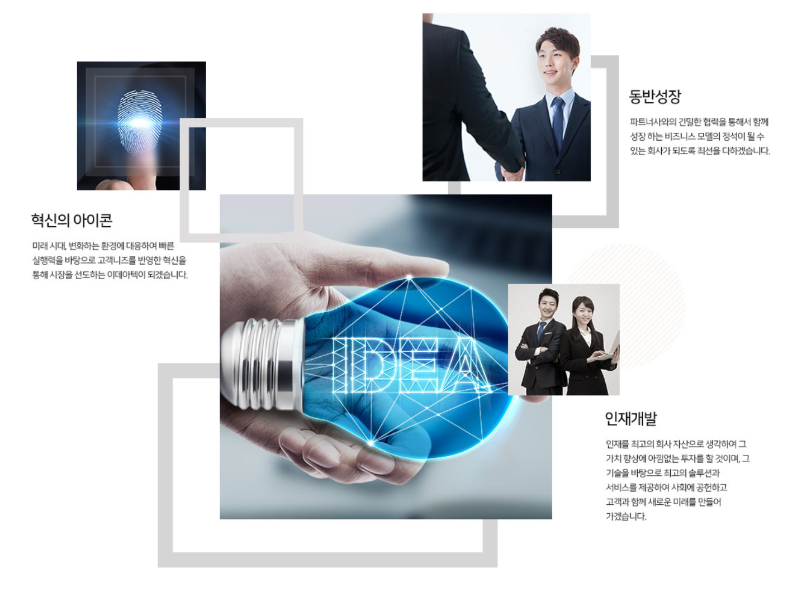

이데아텍이라는 이름하에 IT 솔루션, 컨설팅 전문가들이 모여 토탈 솔루션, 통합 플랫폼 서비스를 시작합니다. 고객 니즈라는 최우선의 가치 달성을 위해 언제나 노력하는 기업이 되겠습니다.

“신뢰를 바탕으로 가치창출에 앞장서는 이데아텍”

이데아텍은 2016년 IT 솔루션, 컨설팅 전문가들이 만든 회사로, 이데아(Idea) + 테크놀로지(Technology)의 합성어로 IT기술의 본질적 가치를 지향합니다. 이데아텍이 생각하는 기술의 본질적 가치는 고객의 목표달성입니다. 해당 프로젝트를 통해 고객이 달성하고자 하는 목표(GOAL)을 명확히 파악하여 필요한 기술과 인력을 제공할 수 있도록 하겠습니다.

이를 위해 내부 혁신과 제품개발, 인력양성 등 기업 역량강화에 투자를 아끼지 않을 것입니다.

우리는 빠르게 변화하는 시대에 살고 있습니다. 내외부적인 환경변화에 따라 온라인의 중요성은 나날이 증가하고 있으며 이에 따라 기업과 기관들은 각각의 환경에 맞는 온라인 플랫폼을 구축해야만 합니다.

제품의 제조, 판매, 유통, 서비스, 대국민/대고객 서비스, 교육 등 그동안 오프라인에서 행해졌던 모든 행위들이 이제 온라인에서 이뤄지고 있습니다.

이데아텍은 이에 대한 시장별 프레임을 가지고 토탈 솔루션, 통합 플랫폼 서비스를 제공합니다.

인프라, 빅데이터, AI, 챗봇, 보안, 인증 등 온라인 플랫폼 구축에 필요한 모든 영역에 대한 역량을 보유하고 있습니다.

자체 개발 솔루션, 신뢰성 있는 파트너쉽, 기술인력 양성을 통해 고객에게 최고의 가치를 전달할 수 있는 이데아텍이 되겠습니다. 

